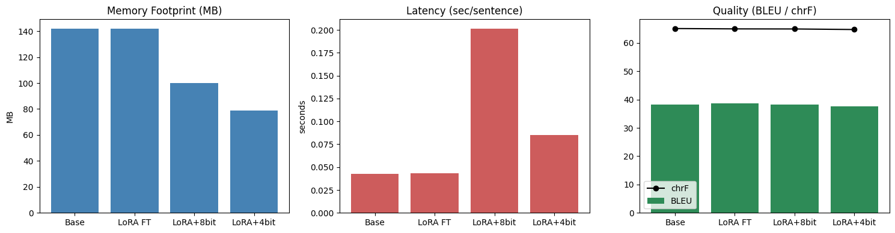

# lora_ft-quantise

# Compressing a Machine Translation Model: LoRA Fine-Tuning + Quantization

A hands-on study of what compression actually costs and buys you, using English→German
translation as the test case. This project fine-tunes a pretrained MT model with LoRA,
then compresses it with 8-bit and 4-bit quantization, measuring the real trade-offs in
memory, latency, and translation quality at every stage — rather than assuming
compression is a uniform win.

## Setup

| Component | Choice | Why |
|---|---|---|
| **Model** | [`Helsinki-NLP/opus-mt-en-de`](https://huggingface.co/Helsinki-NLP/opus-mt-en-de) | Standard `MarianMTModel`, no custom/remote code, well-known En→De baseline. Small enough (74M params) to fine-tune and quantize on a free Colab GPU, large enough for the compression effects to be measurable. |
| **Tokenizer** | Bundled `MarianTokenizer` | SentencePiece-based, loads natively via `AutoTokenizer`/`MarianTokenizer` — no extra dependencies. |
| **Dataset** | [`regisss/wmt14-en-de-pre-processed`](https://huggingface.co/datasets/regisss/wmt14-en-de-pre-processed) | Standard WMT14 En-De benchmark (the same split used across MT literature), repackaged without a loading script so it works cleanly with modern `datasets` versions. Trained on a 20k-sentence subset, evaluated on 300 held-out pairs from `newstest2014`. |
| **Fine-tuning method** | LoRA (rank 8) | Only **589,824 / 74,410,496 params trainable (0.79%)** — demonstrates parameter-efficient fine-tuning directly. |
| **Compression method** | `bitsandbytes` 8-bit and 4-bit (NF4) quantization | GPU-native quantization, since all benchmarking was done on a single Colab GPU throughout (no CPU/ONNX quantization, which wouldn't show any benefit on this hardware). |

## Pipeline

1. **Base pretrained** — zero-shot baseline, no modification.
2. **LoRA fine-tuned** — LoRA adapters trained on WMT14 subset, then merged into the base weights (`merge_and_unload()`) to produce a single standalone model.
3. **LoRA + 8-bit quantized** — merged model reloaded via `BitsAndBytesConfig(load_in_8bit=True)`.
4. **LoRA + 4-bit quantized** — merged model reloaded via `BitsAndBytesConfig(load_in_4bit=True, bnb_4bit_quant_type="nf4")`.

Every stage was benchmarked identically: same 300-sentence held-out eval set, same GPU, same generation settings (beam search, width 5).

## Results

| Stage | Params | Memory (MB) | Latency (sec/sentence) | BLEU | chrF |
|---|---|---|---|---|---|
| 1. Base pretrained | 74,410,496 | 142.0 | 0.0425 | 38.31 | 65.06 |
| 2. LoRA fine-tuned | 74,410,496 | 142.0 | 0.0432 | 38.65 | 64.94 |
| 3. LoRA + 8-bit | 74,410,496 | 100.0 | 0.2015 | 38.16 | 64.91 |
| 4. LoRA + 4-bit | 74,410,496 | 79.0 | 0.0848 | 37.63 | 64.71 |

*Note: parameter count is the true logical count for all stages. `bitsandbytes` packs
4-bit weights two-per-byte for storage, which makes naive `numel()` counts on the raw
tensors misleading — the model has the same number of logical weights at every stage;
only their storage precision changes.*

## Qualitative example

The clearest single illustration of the whole pipeline, from the eval set:

> **EN:** Obama receives Netanyahu
> **DE reference:** Obama empfängt Netanyahu

| Stage | Output | Correct? |
|---|---|---|
| Base pretrained | Obama **erhält** Netanjahu | *"erhält" = receives/obtains — slightly off register* |
| LoRA fine-tuned | Obama **empfängt** Netanjahu | ✅ matches reference |
| LoRA + 8-bit | Obama **empfängt** Netanjahu | ✅ fine-tuning's fix survived moderate compression |
| LoRA + 4-bit | Obama **erhält** Netanjahu | ❌ aggressive compression reverted the fix |

On more straightforward sentences (see full examples in the notebook), all four stages
converge to identical, correct output — degradation is concentrated in the harder,
more nuanced cases rather than spread uniformly across everything.

## Key findings

**1. Memory and latency are not the same axis, and compression can help one while hurting the other.**
Memory footprint dropped monotonically across every stage (142MB → 142MB → 100MB → 79MB), exactly as expected. Latency did **not** follow the same pattern — 8-bit quantization was the *slowest* stage of all (0.20s/sentence, ~5x slower than the uncompressed baseline), despite using less memory. This happens because `bitsandbytes` int8 inference dequantizes weights to fp16 on-the-fly for every matrix multiplication; on a small model with short sequences, that overhead outweighs any savings from smaller weights. 4-bit was faster than 8-bit (0.085s) but still ~2x slower than uncompressed. **The practical takeaway: never assume a compression technique improves speed just because it improves size — the two need to be measured independently.**

**2. LoRA fine-tuning showed a modest, not dramatic, improvement — and that's an expected result, not a failure.**
`opus-mt-en-de` was already trained on large volumes of parliamentary/news text, which is exactly the domain of the WMT14 fine-tuning data. Fine-tuning an already-strong model on data close to what it already knows leaves little room for improvement (BLEU moved from 38.31 to 38.65). A more out-of-domain fine-tuning set would likely show a larger gain, at the cost of a less standard baseline comparison.

**3. Quality degrades gracefully, not catastrophically, under compression.**
Both 8-bit and 4-bit stages preserved translation quality closely (BLEU/chrF drops of under 1 point at 4-bit, the most aggressive setting), with degradation concentrated in specific harder sentences rather than global collapse. This matches the general pattern reported in quantization literature — modern quantization methods are quite good at preserving output quality even at low bit-widths, for the cost of the metric drop shown above.

## Limitations & possible extensions

- **Knowledge distillation was scoped out** of this project in favor of quantization-only compression, due to compute constraints (KD requires running teacher inference over the full training set, which is significantly more expensive than direct fine-tuning). A natural next step would be distilling this fine-tuned model into a smaller architecture (fewer layers) and comparing against the quantization results here.
- **CPU and ONNX quantization were intentionally excluded**, since all benchmarking was done on a Colab GPU — CPU-oriented quantization paths (`torch.quantization.quantize_dynamic`, ONNX Runtime INT8) show no benefit or can regress on GPU hardware. A CPU-focused benchmarking pass would need a separate, CPU-only measurement pipeline.
- **The eval set (300 sentences) is intentionally small** — large enough for a reliable BLEU/chrF signal and to inspect individual examples by hand, but a full-scale evaluation (e.g., the full `newstest2014` set) would give more statistically robust numbers.

## Stack

`transformers==4.55.4` · `datasets==4.3.0` · `peft>=0.13` · `bitsandbytes>=0.44` · `accelerate==1.10.1` · `sacrebleu` / `evaluate==0.4.5` · Colab GPU runtime
